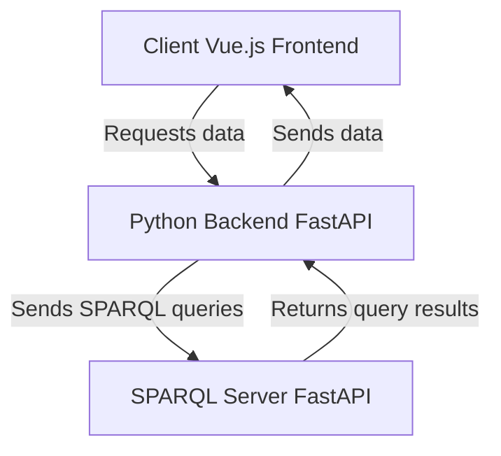

# pokepedia-semantic-web

This project is based on the RDF data from pokepedia.fr . Its goal is to provide a fun interface to help users build a strategic team of 6 pokemon with ideal type coverage.

The project is splitted between client and sparql server

- The server exposes a SPARQL enpoint to which SPARQL requests can be made
- The client uses SPARQL requests to explore and present the data

# Requirements

This project uses **python 3.13.5** and **node 24.5.0** \
To install the dependencies:

- use `pip install -r requirements.txt` in the root directory,
- use `npm install` in the `client/front/` directory.

# SPARQL Server

### Start server

To launch the server, go in the `server/` directory and do `uvicorn app:app --port 8010`

```shell
cd server
uvicorn app:app --port 8010
```

### Utilization

The only endpoint is `http://localhost:8010/sparql` and has 2 GET parameters

- `query`: (str) The SPARQL query to execute
- `remove_prefix`: (bool) Wether to remove the prefix before the names, ex: "<http://prefix.example:Name>" into "Name"

# Client: Python Backend

The backend of this app is a FastAPI app.
To run it, you need to start both SPARQL server.

## server used for endpoints

```shell
cd client/back
uvicorn app:app --port 8020
```

You will use this server to make requests from the Vue.js frontend.
Supported endpoints are:

- `/pokemons`: Get data about all pokemons in this format:

```json
{
 "pokemons": [
  {
   "num": "56",
   "pk": "234245",
   "type1": "eau",
   "type2": "feu",
   "gen": "Gen A",
   "famille": "famille A",
   "url": "https://www.pokepedia.fr/Zygarde"
  },
  {
   
  }
 ]
}

```

- `/pokemon/{pk}/coverage`: Gets the list of pokemons that the given pokemon has advantage over:

```json
{
    "coverage": [
        "pk1",
        "pk2",
        "pk3"
    ]
}
```

- `/pokemon/{pk}/disadvantage`: Gets the list of pokemons that have advantage over the given pokemon:

```json
{
 "disadvantage": [
  "pk1",
  "pk2",
  "pk3"
 ]
}
```

## server used for data fetching from SPARQL servers

```shell
cd server
uvicorn app:app --port 8010
```

## Overall backend server pipeline



# Client: Vue.js Frontend

The frontend of this app is a Vue.js app.

Start it running in the `client/front/` directory:

```bash
npm run dev
```
